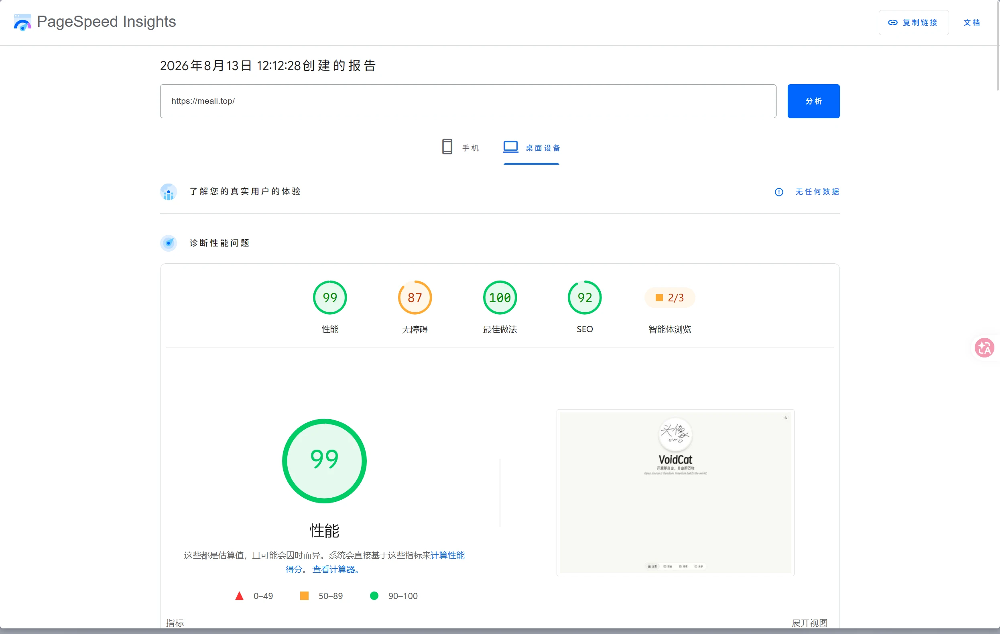
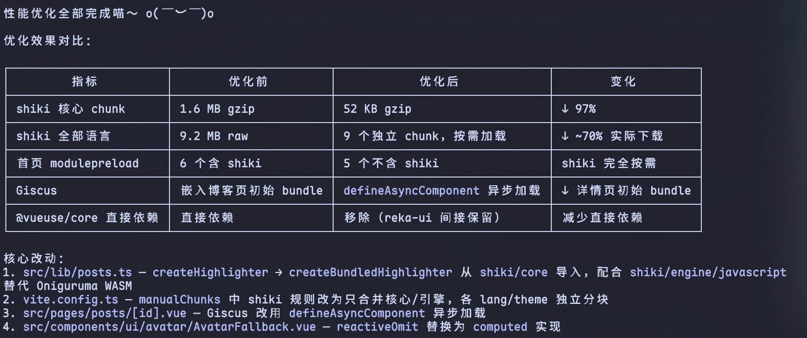

# 为什么要优化

在[上一期](https://meali.top/posts/change2cy)中，我们在最后放了一张lighthouse，分数为75分，可谓是非常屎。但是啊，我们的可爱ai发现有非常多的优化点啊。所以我们要开始优化了！！！

# 结果
先看结果就知道有多么伟大了，伟大程度仅次于mojang发布末地更新：

# 怎么优化
标题都说了是如何，那必须上过程，先叠个甲：此优化方法不一定适用于其他网站，仅供参考。  
## 1.shiki优化
### 分块
总所周知，我们的shiki是处理代码高亮的，它肯定是要兼容多种语言的，但是这几种语言都在一个chuck，极为缓慢，所以我们要把它切开，分块，wonderful啊，一下子减了~70%实际下载
### 核心chuck
我们早期的代码写的非常屎，引用了shiki竟然还用了Oniguruma WASM，坏，所以我们要删掉Oniguruma WASM，直接用shiki，直接省下%97！！！
### 不要老给我加载shiki
我们主页加载了好几个模块，但是6个都含shiki，但是shiki在这时候完全没有，浪费网络资源。所以我们要完全按需加载，速度猛猛变快啊awa
## 评论区优化
我们的giscus是阻塞加载的，bad啊，必须异步！！！
## 不要给我依赖这么多
我们的@vueuse/core是直接依赖的，坏，貌似我们的@vueuse/core直接依赖是useless的，so我们要删掉，只通过reka-ui简介，虽然这真的能提升速度吗。 ~~就算不能也水点内容awa~~
## ai原文

# 结果
从75分到99分，超级大的进步。 ~~并且没有bug!!!~~ 我们的用户体验能好得多！！！
