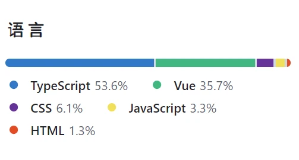
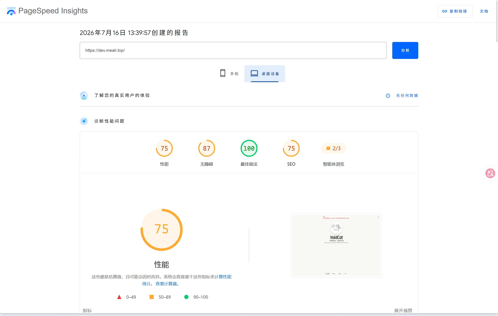

# 这次改了什么？
如你所见，界面完全不一样了，这得益于我们使用的是Tailwind CSS这样的beautiful的css框架。还用了shadcn做组件 ~~，虽然ai味很重就是了~~，虽然这样还是比我手写强我本来就不擅长前端。我们还询问了亿下下ai改进我们的设计，v3版本明显比之前的好看不是吗。

# 为什么又迁移了？？？

我们为什么要从之前的html迁移到v2呢？当然是看重了vue的易维护性和很多功能都不用手写的便捷。虽然是带来了一点点不便但是总比哪html+js+css老掉牙三件套好几倍。但是，由于我v2初期选框架的错误决定选择了unocss并且没有考虑组件库，后面我尝试引入shadcn并且重写组件却屡屡碰壁。以卡片组件举例（绝对不是因为只有这个组件），新的shadcn组件和之前完全不一样导致很不协调，幸亏没合入主v2分支，那么tm得丑死！并且也是使用魔法嫁接的方法兼容的，就很怪因为shadcn原生只支持tailwind。我们的v2的技术债欠了越来越多导致根本加不了，优化不了还不如重写。我们的v3就是为了重置技术债而生的。

# 欸，博客系统为什么集成了？

长久以往，我的的各种子功能都是分散在各个子域名的，这一点都不快捷并且有些公开的子域名只有我自己知道（tg.meali.top,tjl.meali.top），所以我准备把所有的集成，首当其冲的便是我们最重要的博客。所以就集成了（绝对不是因为搭多了集成工业系统）。

# 这次的技术栈又是什么？

我们还是一如既往采用vue,pnpm,vite，这三样还是太权威了。但是由于shadcn的影响，我们的项目成分复杂（是我了），如图所示：，见上文，我使用了shadcn和tailwind，tailwind还是太好用了你们知道吗。整个项目开发几乎没有遇到问题，因为采用了主流选择。

# 怎么~~丝滑~~迁移的呢？

首先，因为他是同一个系列的，so我们新开了v3分支并且吧之前的混乱命名都改成v1,v2。然后，我们进行紧锣密鼓的~~玩终末地~~开发 ~~（非也，实际上是指挥ai然后在后台让ai干活）~~，然后部署在dev.meali.top进行prod测试，然后，终于完善了！！！就把实际上的prod改成了v3分支，就成功了！！！very easy，但是实际上也very easy。呃，总之就是可以取代v2了（实际上v1的很多功能还没有实现owo）  

~~最后再看一下lighthouse。坏，回去优化一下。~~
