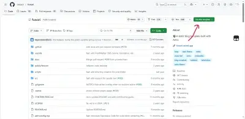

# 初始化

## 方式 1：Github 上直接使用模板

打开 [saicaca/fuwari](https://github.com/saicaca/fuwari)，然后点开下图 Use this template 按钮

然后跟 Github 的流程走，获得了自己的仓库之后 clone 下来。

## 方式 2：本地创建

随便选一个文件夹，运行 `pnpm create fuwari@latest`。

# 第一篇文章

[saicaca/fuwari](https://github.com/saicaca/fuwari) 的 README 里面有一些内容。

还可以根目录运行 `pnpm dev`，然后打开网页，里面会有几个文章，请自己阅读，这是一些基本教程。

# 部署

有各种部署方式，这里选 Edgeone Pages 国际版进行讲解，如果不是请自己探索。

本篇所有内容都是建立在你有一个域名接入了 Edgeone 的前提下。

## 创建 Pages

先推送你本地 git 里面的内容。

打开 Pages 选项卡，选择新建 Pages，并且关联你的 Github 仓库。

## 自定义域名

打开那个 Page 的域名管理选项卡，点击新建域名，输入你的域名然后跟着 Edgeone 的提示接入。
